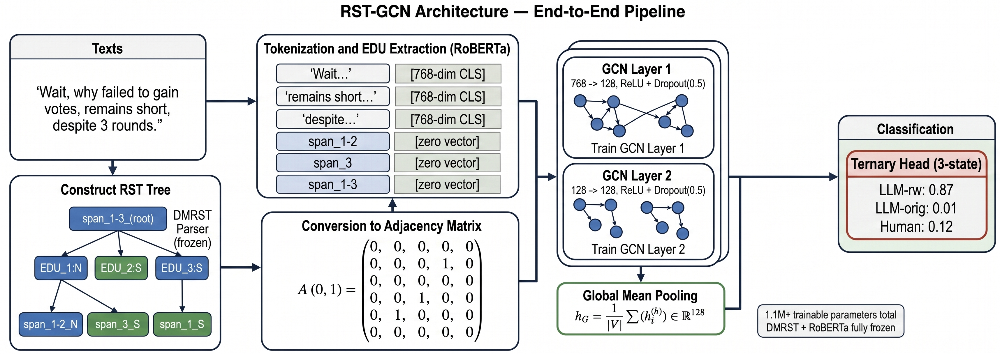

# RST-GCN: When Humans Write and LLMs Rewrite
### Detecting AI-Paraphrased Text through Rhetorical Structure Graphs

[](https://www.cikm2026.org/)
[](https://www.python.org/)
[](https://pytorch.org/)
[](LICENSE)

> **Paper:** *When Humans Write and LLMs Rewrite: Detecting AI-Paraphrased Text through Rhetorical Structure Graphs*
> **Authors:** Shifali Agrahari, Hemanth Prakash Simhadri, Sanasam Ranbir Singh
> Submitted to **35th ACM International Conference on Information and Knowledge Management (CIKM'26)**
> Submission #2928 — Under Review

---

## Overview

RST-GCN is the **first discourse-graph-based framework** for detecting LLM-paraphrased human text. While existing detectors collapse under paraphrase attacks (falling to near-random performance), RST-GCN maintains **84–90% accuracy** by exploiting Rhetorical Structure Theory (RST) — a representation that encodes *why* text is written rather than *how*, making it inherently robust to surface-level rewriting.

**Key insight:** Paraphrase changes *how* something is said, not *why*. RST captures the *why* — and that is what survives.

<p align="center">
  
  <br>
  <em>Figure: RST-GCN pipeline — text → RST discourse tree → graph → GCN → classification</em>
</p>

---

## Highlights

- **97.1%** binary detection accuracy on HC3
- **84–90%** accuracy under paraphrase attack (vs. PRDetect's ~50%)
- **Novel 3-class task**: Human / LLM-original / LLM-paraphrased
- **28–44 pp** improvement over fine-tuned RoBERTa on 3-class task
- **Only 115K trainable parameters** — trains on a single GPU in under 1 hour
- Strong multilingual results: Arabic M4 **95.7%**, Chinese M4 **89.3%**
- Cross-domain and cross-model generalisation without fine-tuning

---

## Problem Statement

Existing detectors are binary classifiers (Human vs. LLM). In practice, users write text themselves and then use LLMs to **paraphrase, polish, or rewrite** it. This creates a third class that binary classifiers cannot handle:

```
Class 0 — Human-written            (original human text)
Class 1 — LLM-original             (fully LLM-generated)
Class 2 — LLM-paraphrased human    (human text rewritten by LLM)
```

RST-GCN supports **both binary and ternary** detection.

---

## Architecture

```
Input Text
    │
    ▼
┌─────────────────────────────┐
│  Stage 1: DMRST Parser      │  XLM-RoBERTa backbone (frozen)
│  RST Discourse Tree         │  → EDU segmentation + tree induction
└─────────────────────────────┘
    │
    ▼
┌─────────────────────────────┐
│  Stage 2: Graph Construction│  Leaf nodes: RoBERTa [CLS] (768-dim, frozen)
│  Node features + Adj matrix │  Internal nodes: zero vectors
│  Structural + Rhetorical    │  Adjacency: structural + rhetorical edges
│  edges                      │  Normalisation: D^-0.5 A D^-0.5
└─────────────────────────────┘
    │
    ▼
┌─────────────────────────────┐
│  Stage 3: 2-Layer GCN       │  Layer 1: 768 → 128 + ReLU + Dropout(0.5)
│  Graph Convolutional Network│  Layer 2: 128 → 128 + ReLU + Dropout(0.5)
│                             │  Pooling: Global mean pooling → h_G ∈ R^128
└─────────────────────────────┘
    │
    ▼
┌─────────────────────────────┐
│  Stage 4: Classification    │  Binary:  sigmoid → BCELoss
│                             │  Ternary: softmax → CrossEntropyLoss
└─────────────────────────────┘
    │
    ▼
  Human / LLM-original / LLM-paraphrased
```

**Total trainable parameters: ~115K** (GCN layers + classifier head only)

---

## Results

### Binary Classification (Human vs. LLM-original)

| Method | HC3 | GPT-3.5 | M4 | Mage | RAID |
|--------|-----|---------|----|----|------|
| Likelihood | 0.968 | 0.898 | 0.791 | 0.611 | 0.699 |
| LogRank | 0.980 | 0.908 | 0.771 | 0.622 | 0.710 |
| RoBERTa (ZS) | 0.950 | 0.905 | 0.768 | 0.691 | 0.765 |
| DetectGPT | 0.682 | 0.507 | 0.512 | 0.524 | 0.501 |
| PRDetect | 0.965 | **0.916** | 0.814 | **0.729** | 0.800 |
| **RST-GCN (Ours)** | **0.971** | 0.901 | **0.845** | 0.709 | **0.838** |

### Three-Class Classification (Human / LLM-original / LLM-paraphrased)

| Method | Paraphrase Via | HC3 | GPT-3.5 | M4 | Mage | RAID |
|--------|---------------|-----|---------|----|----|------|
| RoBERTa | Llama | 0.584 | 0.521 | 0.453 | 0.370 | 0.448 |
| RoBERTa | Gemma | 0.586 | 0.560 | 0.471 | 0.376 | 0.474 |
| **RST-GCN** | **Llama** | **0.931** | **0.903** | **0.823** | **0.733** | **0.828** |
| **RST-GCN** | **Gemma** | **0.954** | **0.892** | **0.854** | **0.735** | **0.810** |

### Paraphrase Attack Robustness

| Method | HC3 | GPT-3.5 | M4 | RAID |
|--------|-----|---------|----|----|
| PRDetect | 55.0% | 50.6% | 55.0% | 60.9% |
| **RST-GCN** | **90.2%** | **87.5%** | **84.5%** | **86.5%** |

---

## Datasets

| Dataset | Domain | Languages | Classes |
|---------|--------|-----------|---------|
| HC3 | QA (CS, Finance, Medicine, Law) | EN, ZH | Human / ChatGPT |
| GPT-3.5-Mixed | News (CNN, BBC, Times) | EN | Human / GPT-3.5 |
| M4 | Multi-domain | EN, AR, ZH | Multi-generator |
| Mage | News + Social Media | EN | Multi-generator |
| RAID | Multi-domain + adversarial attacks | EN | Multi-generator |

**Three-class paraphrase datasets** generated using 5 LLM rewriters:
- Split 1: **LLaMA** (`meta-llama/Llama-3.2-3B-Instruct`)
- Split 2: **Mistral** (`mistral-7b-instruct-v0.2`)
- Split 3: **Qwen** (`Qwen/Qwen3-1.7B`)
- Split 4: **Phi** (`Phi-3-medium-4k-instruct`)
- Split 5: **Gemma** (`google/gemma-3-4b-it`)

---

## Repository Structure

```
RST-GCN/
├── DMRST_Parser/                   # DMRST discourse parser (frozen)
│   └── depth_mode/
│       └── Savings/
│           └── multi_all_checkpoint.torchsave
├── Code for binary/                # Binary (2-class) detection scripts
│   ├── step1_parse.py              # RST parsing → graphs/edus/labels
│   ├── step2_embeddings.py         # RoBERTa EDU embeddings
│   ├── step3_train.py              # GCN training (BCELoss)
│   └── step4_test.py               # Inference + metrics
├── datasets/                       # Dataset files (see Data Preparation)
│   └── ds/
│       ├── train.csv
│       ├── val.csv
│       └── test.csv
├── models/                         # Saved model checkpoints
├── rst_gcn_model.py                # RST-GCN model + GCNConv + prepare_batch
├── step1_parse.py                  # 3-class RST parsing
├── step2_embeddings.py             # 3-class EDU embeddings
├── step3_train.py                  # 3-class GCN training (CrossEntropyLoss)
└── step4_test.py                   # 3-class inference + metrics
```

---

## Installation

```bash
git clone https://github.com/hemanthsp01/RST-GCN.git
cd RST-GCN

# Create environment
conda create -n rst_gcn python=3.10
conda activate rst_gcn

# Install dependencies
pip install torch torchvision torchaudio --index-url https://download.pytorch.org/whl/cu118
pip install transformers networkx pandas numpy scikit-learn tqdm regex
```

### Download DMRST Parser

```bash
# Clone DMRST parser into the project root
git clone https://github.com/seq-to-mind/DMRST_Parser.git

# Download pretrained checkpoint
# Place at: DMRST_Parser/depth_mode/Savings/multi_all_checkpoint.torchsave
```

---

## Data Preparation

Input CSV format (place in `data/ds/`):

```
text,label,source_type
"The patient presented with ...",0,human
"The study examined multiple ...",1,ai_generated
"Following a comprehensive review ...",2,paraphrased
```

| Column | Values | Description |
|--------|--------|-------------|
| `text` | string | Input text |
| `label` | 0 / 1 / 2 | 0=human, 1=AI-original, 2=AI-paraphrased |
| `source_type` | human / ai_generated / paraphrased | Used for label resolution |

---

## Usage

### 3-Class Detection (Human / LLM-original / LLM-paraphrased)

```bash
# Step 1: Parse texts into RST discourse graphs
python step1_parse.py

# Step 2: Generate RoBERTa EDU embeddings (768-dim)
python step2_embeddings.py

# Step 3: Train RST-GCN (CrossEntropyLoss, 3-class)
python step3_train.py

# Step 4: Evaluate on test split
python step4_test.py
```

### Binary Detection (Human vs. LLM)

```bash
cd "Code for binary"

python step1_parse.py
python step2_embeddings.py
python step3_train.py
python step4_test.py
```

### Configuration

Edit `step3_train.py` CONFIG:

```python
CONFIG = {
    'input_dim':           768,    # RoBERTa embedding size
    'hidden_dim':          128,    # GCN hidden size
    'num_classes':         3,      # 2 for binary, 3 for ternary
    'dropout':             0.5,
    'learning_rate':       0.001,
    'epochs':              30,
    'early_stop_patience': 10,
}
```

---

## Model Details

| Component | Details |
|-----------|---------|
| RST Parser | DMRST (XLM-RoBERTa backbone, frozen) |
| Node Embeddings | RoBERTa-base [CLS] token, 768-dim, frozen |
| GCN Layer 1 | 768 → 128, ReLU, Dropout(0.5) |
| GCN Layer 2 | 128 → 128, ReLU, Dropout(0.5) |
| Pooling | Global mean pooling |
| Binary head | Linear(128,1) + Sigmoid + BCELoss |
| Ternary head | Linear(128,3) + Softmax + CrossEntropyLoss |
| Trainable params | ~115K |
| Optimizer | Adam (lr=0.001) |
| Training time | < 1 hour on single GPU |

---

## Citation

If you use this work, please cite:

```bibtex
@inproceedings{rst-gcn-cikm2025,
  title     = {When Humans Write and LLMs Rewrite: Detecting AI-Paraphrased Text through Rhetorical Structure Graphs},
  author    = {Agrahari Shifali and Simhadri Hemanth Prakash and Sanasam Ranbir Singh},
  booktitle = {Proceedings of the 35th ACM International Conference on Information and Knowledge Management (CIKM '26)},
  year      = {2026},
  publisher = {ACM},
  note      = {Under Review},
  doi       = {TBD}
}
```

---

## License

This project is licensed under the MIT License. See [LICENSE](LICENSE) for details.

> **Note:** The DMRST parser is subject to its own license. The `TrustSafeAI/RADAR-Vicuna-7B` model is for non-commercial use only.

---

## Acknowledgements

- [DMRST Parser](https://github.com/seq-to-mind/DMRST_Parser) — document-level multilingual RST parser
- [PRDetect](https://aclanthology.org/2025.findings-naacl.521/) — syntax-tree baseline (NAACL 2025)
- [HC3](https://arxiv.org/abs/2301.07597), [M4](https://aclanthology.org/2024.eacl-long.83/), [Mage](https://aclanthology.org/2024.acl-long.18/), [RAID](https://aclanthology.org/2024.acl-long.74/) — benchmark datasets
